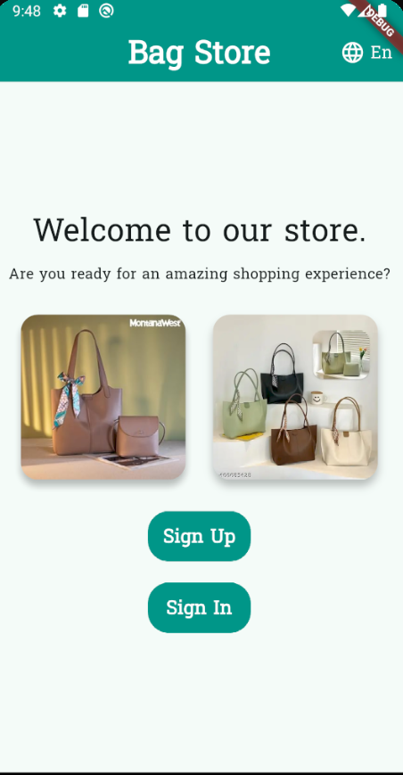
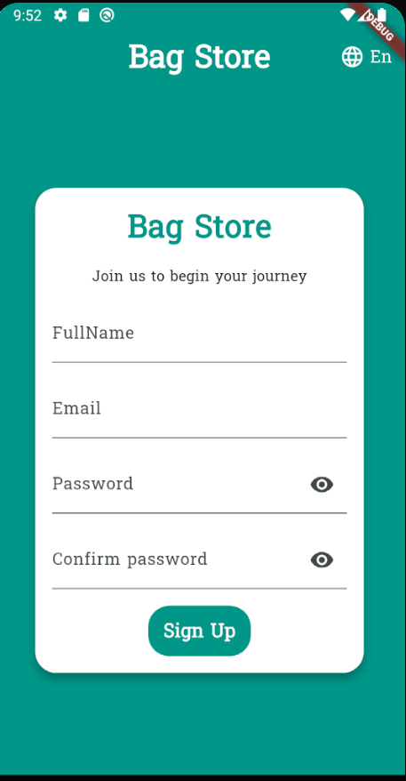
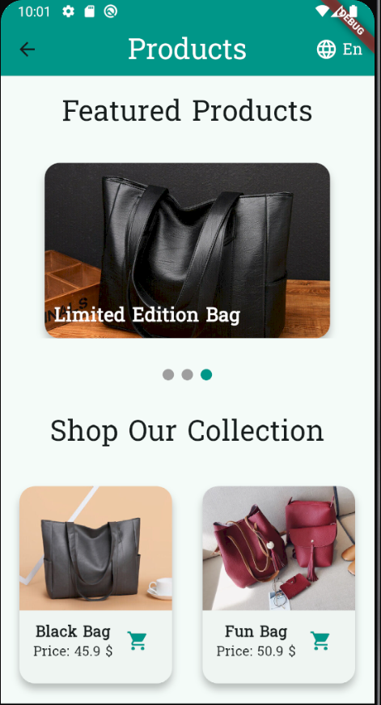

# 👜 Shopping App (Flutter)

## 📌 Project Overview
Shopping App is a demo app built using **Flutter**.
It offers a welcome interface, login, new account registration, and multilingual support (Arabic/English).
The goal of the project is to create a simple online store for learning and experimenting.# 👜 Shopping App (Flutter)


## ✨ Features
- 🌍 **Multilingual support** (EN/AR) using `easy_localization`.
- 👤 **Login and registration screens**.
- 🛒 **Welcome screen with product images**.
- 🎨 **Modern design using Material Design**.
- 📱 **Compatible with Android and iOS**.

---

## ⚙️ Setup Instructions

### 1. Clone the repository
```bash
git clone https://github.com/ayaabduljawad750-cyber/shopping_app
cd shopping_app

### 📸 Screenshots

### 🏠 Welcome Screen


### 🆕 Sign Up Screen


### 🔑 Sign In Screen


### 🔑 Home Screen

